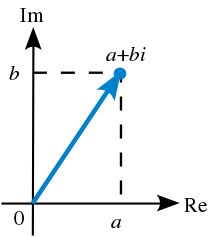
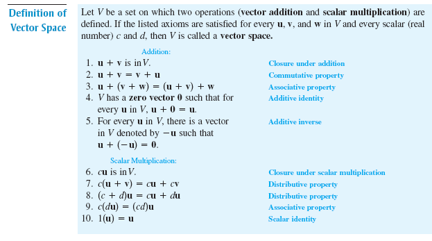

# Algebra i geomteria

- [Algebra i geomteria](#algebra-i-geomteria)
  - [Números complejos](#números-complejos)
    - [Intro](#intro)
      - [Conjuntos](#conjuntos)
    - [Plano complejo](#plano-complejo)
      - [Formas Numeros complejos](#formas-numeros-complejos)
      - [Operaciones](#operaciones)
    - [Descomposición factoriales](#descomposición-factoriales)
  - [Matrices](#matrices)
  - [sistemas lineales](#sistemas-lineales)
  - [Espacios vectoriales](#espacios-vectoriales)
    - [SELH mxn](#selh-mxn)
    - [Dependencia lineal](#dependencia-lineal)
  - [Aplicacions lineales](#aplicacions-lineales)

## Números complejos

### Intro

#### Conjuntos

- $\N$:Naturales
- $\Z$:Enteros
- $\mathbb{Q}$:Racionales
- $\R$:reales
- $\mathbb{C}$: Complejos

### Plano complejo

#### Formas Numeros complejos

- **Forma Binomica**: $z_1=a+bj$
  - Parte Real: $a$
  - Parte Imaginaria: $b$
  - Modulo: $\sqrt{a^2+b^2}$
  - Argumento: $\arctan{\frac{b}{a}}$
  - conjugado: $a-bj$
- **Forma exponencial**: $z_1=re^{j \theta}$

  - Parte Real: $r\cos{\theta}$
  - Parte Imaginaria: $r\sin{\theta}$
  - Modulo: $r$
  - Argumento: $\theta$
  - conjugado: $re^{-j\theta}$

- **Forma Trigonometrica**:
  $z=r(\cos{\theta}+j\sin{\theta})$

$e^{j\theta} = \cos{\theta}+j\sin{\theta}$

#### Operaciones

- **Raiz**$\Rarr\sqrt[n]{Z}=z^{\frac{1}{n}}$
  - n soluciones
  - $\sqrt[n]{Z}=z^{\frac{1}{n}}=w\Rarr z=w^n\Rarr re^{j\theta}=x^ne^{jny}\\x=\sqrt[n]{r}\\ny=\theta + 2k\pi\\\sqrt[n]{z}=\sqrt[n]{r}e^{j\frac{\theta + 2k\pi}{n}} \forall k\in \N\ U\ \{0\} ;k<n$

### Descomposición factoriales

## Matrices

- **mef**$\Rarr$ matriz escalonada por filas$\Rarr$ ref$\Rarr$ Gauss(filas)
- **merf**$\Rarr$ matriz escalonada por filas$\Rarr$ rref$\Rarr$ Gauss-Jordan
- **Rango**$\Rarr$
  - Combinacion lineal de filas
  - Independencia lineal
    - 2 filas: $\{f_i,f_j\}$
      - No: $f_j=\lambda f_i$
      - Si: otherwise
    - 3 filas:
      - No $f_k=\alpha f_i +\beta f_j$
      - Si: otherwise
- **Regular:** $r(A)=n\iff det(A)\neq0\iff MEF_A=I_n\iff$ tiene inversa
  - $\begin{pmatrix}
    2&-1\\-5&3
  \end{pmatrix}$
- **Singular**2&-1\\-5&3:$r(A)<n\iff det(A)=0\iff MEF_A$ tiene fila nula

## sistemas lineales

## Espacios vectoriales

### SELH mxn

Conjunto vectores V

### Dependencia lineal

- Sea V e.v $\in \R$ $S={\overrightarrow{v}_1,\overrightarrow{v}_2,\overrightarrow{v}_3,\dots,\overrightarrow{v}_k}$
- Se considera combinación linea el resultado de: $\overrightarrow{W}=\alpha_1\overrightarrow{v}_1\alpha_1\overrightarrow{v}_1\alpha_1\overrightarrow{v}_1+\alpha_2\overrightarrow{v}_2+\alpha_3\overrightarrow{v}_3+\dots+\alpha_k\overrightarrow{v}_k$
- Trivial $\alpha_k=0\Rarr\overrightarrow{W}=\overrightarrow{0}$
- si un conjunto de vectores tiene como comvinacion lineal el vector $\overrightarrow{0}$ se considera ligado
- libre otherwise

## Aplicacions lineales
