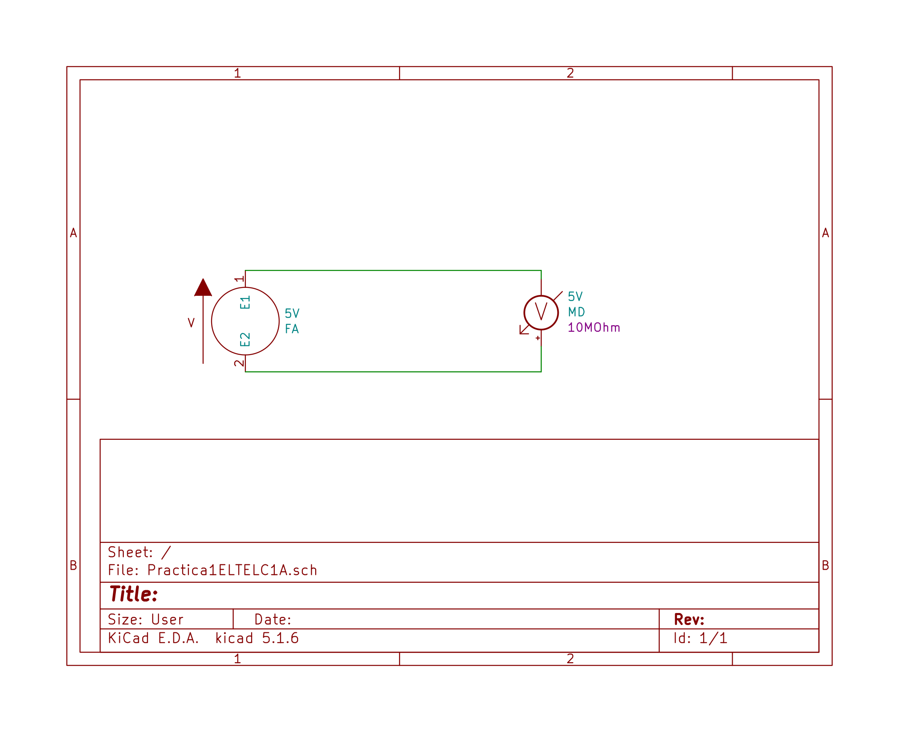
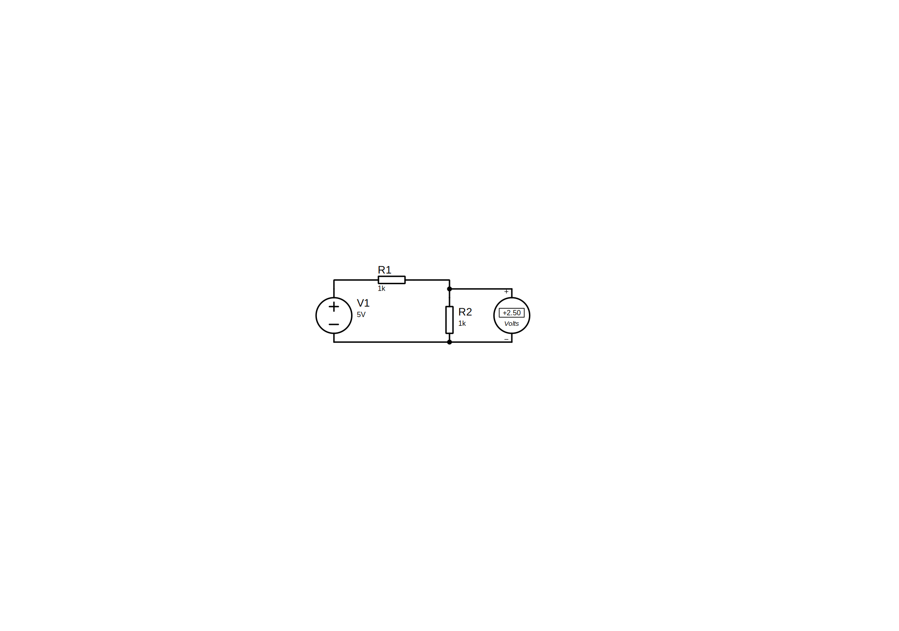
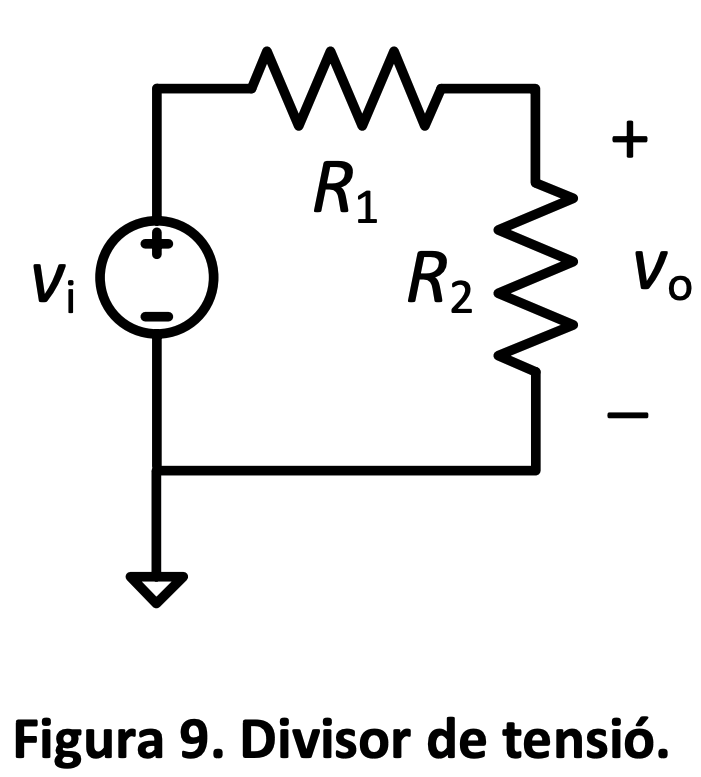
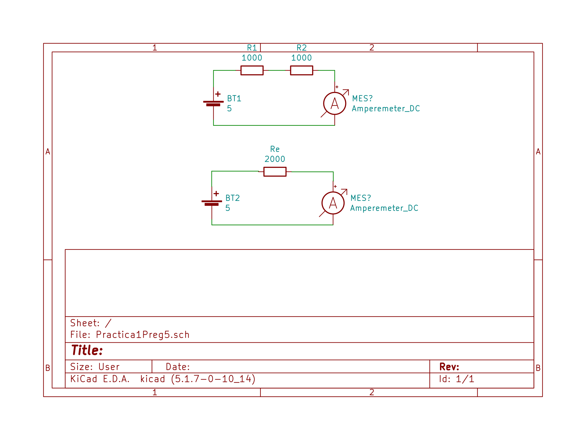

# Electronica de telecomunicaciones

## Index

- [Electronica de telecomunicaciones](#electronica-de-telecomunicaciones)
  - [Index](#index)
  - [Laboratorio](#laboratorio)
    - [Practica 1](#practica-1)
      - [Preg 0](#preg-0)
      - [Preg 1](#preg-1)
      - [Preg 2](#preg-2)
      - [Preg 3](#preg-3)
      - [Preg 4](#preg-4)
      - [Preg 5](#preg-5)
      - [Preg 6](#preg-6)
    - [Practica 2](#practica-2)
      - [Preg1](#preg1)
        - [1A](#1a)
        - [1B](#1b)
        - [1C](#1c)
        - [1D](#1d)
      - [Preg2](#preg2)
        - [2A](#2a)
        - [2B](#2b)
        - [2C](#2c)
        - [2D](#2d)
        - [2E](#2e)
        - [2F](#2f)
        - [2G](#2g)
      - [Preg 3](#preg-3-1)
        - [3A](#3a)
        - [3B](#3b)
        - [3C](#3c)
        - [3D](#3d)
        - [3E](#3e)
  - [Teoria](#teoria)
    - [Análisis de circuitos](#análisis-de-circuitos)
    - [Componentes](#componentes)
      - [Generico](#generico)
      - [Resistencia](#resistencia)
      - [Circuito abierto](#circuito-abierto)
      - [Corto circuito](#corto-circuito)
      - [Condensadores](#condensadores)
      - [Bobina/Inductor](#bobinainductor)
      - [Fuente ideal de tensión](#fuente-ideal-de-tensión)
      - [Fuente ideal de corriente](#fuente-ideal-de-corriente)

## Laboratorio

### Practica 1

#### Preg 0

Reviseu els instruments que teniu en el vostre lloc de treball i comproveu que coincideixen amb els de la Taula 1 del guió. En cas de que en hi hagin dos, marqueu el que correspongui. Si no hi ha coincidència, actualitzeu el model. D’aquí en endavant haureu de consultar els manuals dels instruments corresponents.

#### Preg 1

Llegiu la introducció de la FA d’aquest guió i el manual de l’instrument que trobareu aquí (per saber el model, consulteu primer el laboratori que teniu assignat per les pràctiques i desprès la Taula 1) i contesteu els següents apartats:

a) Anoteu el marge d’ajust de tensió i del corrent límit de cadascuna de les sortides de la FA

- Dreta:[0,30]V, 1A
- Centre: 5V,2A
- Esquerra:[0,30]V,1A

b) Descriviu el procediment per a fixar un límit de corrent i què ocorre si s’excedeix el límit de corrent fixat.

- Per augmentar la tolerancia girar la rodeta inferior en sentit horari
- En cas de superar la corren es talla la alimentació

c)Es vol configurar una de les sortides amb una tensió de 5 V i un límit de corrent de 50 mA. Deduïu la tensió i corrent de sortida quan es connecti a la sortida una resistència de:

1. 220 Ω $\Rarr$22,7mA

2. 47 Ω. $\Rarr$106mA

#### Preg 2

Llegiu la introducció del MD d’aquest guió i el manual del MD que trobareu aquí (per saber el model, consulteu la Taula 1)i contesteu als següents apartats:

a. Expresseu la resolució del MD en nombre de dígits i en nombre de comptes.

- 0.1mV en un rang de 400mV
- 1μA en un rang de 4mA
- $0.1\Omega$ en el rang de $400\Omega$
- 1pF en un rang de 4nF

b.Descriviu breument el procediment per a la mesura de tensions, corrents i resistències

- per mesurar tensió posem el MD en el rang desitjat i coloquem els terminals seguint la polaritat del circui i en paralel.
- per mesurar la corrent posem el MD en el rang desitjat i coloquem els terminals seguint la polaritat del circuit i en serie al mateix.
- per mesurar la resistencia posem el MD en el rang desitjat i coloquem els terminal als extrems del circuit a mesurar

c. Descriviu com commutar entre la selecció d’escales manual o automàtica i com commutar entre la mesura en DC o AC

- per passar a mode manual pulsem el buto "Manual Range button" i per tornar al automàtic el mantenim pulsat per 2s

d.Anoteu les escales disponibles i la resolució associada per les mesures de tensió i corrent continus (DC) així com de resistència.

- Tensió
  - 400mV$\Rarr$ ± (0.75% + 2D)
  - 4V,40V,400V,600V$\Rarr$ ± (0.5% + 2D)
- Corrent
  - 4mA a 400mA $\Rarr$ ± (0.75% + 2D)
  - 10A $\Rarr$ ± (1.5% + 4D)

#### Preg 3

Es vol mesurar amb el MD la tensió d’una de les sortides de la FA configurada segons la qüestió P1.c. (Nota: ja no s’han d’emprar les resistències de 220 Ω i 47 Ω)

a. Indiqueu les connexions que heu de realitzar entre ambdós instruments.

- El Negatiu amb el negatiu i el positiu de la FA en el el "COM input terminal"

b.Representeu el circuit equivalent modelant la FA com a la Figura 3 i el MD com a la Figura 6.b. Busqueu al manual del MD el valor de la seva resistència (o impedància) d’entrada quan es configura per a la mesura de tensions.

Impedancia $\Rarr$ 10M $\Omega$

c.Indiqueu la funció que escollireu del MD i indiqueu la lectura que proporcionarà l’instrument per a cadascuna de les escales. Així mateix, busqueu al manual la incertesa a cada escala. Nota: La incertesa és el terme correcte però moltes vegadess’utilitzen encara els termesprecisió o exactitud.

Utilitzariem la funció de mesura de voltatge en el rang de 4V, ja que en altres escales pot ser que no ho pogui detectar.

#### Preg 4

Es vol implementar el divisor de tensió de la Figura 9, on vi és la tensió d’entrada, proporcionada per exemple per un FA, i vo la tensió de sortida a mesurar.

a. Obteniu l’expressió algebraica de vo en funció de vi. Així mateix, calculeu el valor numèric de vo si vi = 5 V i R1=R2.

$V_i=V_0+R_1I$ en el si $R_1=R_2$ i $V_i=5V\Rarr V_i=R_1I+R_2I=2R_1I=2V_0\Rarr V_0=\frac{V_i}{2}=2,5V$

b. Procediu a simular el circuit anterior amb el programari Proteus i R1 = R2 = 1 kΩ. Podeu obtenir la tensió vo de dues maneres: 1) amb la sonda de tensió de la paleta de sondes (probes) i 2) amb l’instrument “DC Volmeter” de la paleta d’instruments. Anoteu el valor de vo i comproveu que coincideix amb el calculat a l’apartat anterior.

$V_0=2,5V;V_i=5V$

c. Descriviu com connectar i configurar el MD per a la mesura de la tensió vo en DC.

En aquest cas conectariem el multimetre en paral·lel a la resistencia $R_2$ i el configurariem en el rang de 4V

d. Dibuixeu el circuit equivalent si a l’entrada es connecta una FA (per a generar vi) i a la sortida el MD configurat per a la mesura de tensions contínues. Utilitzeu els models de la Figura 3 per la FA i el de la Figura 6b pel MD.

e. Obteniu novament l’expressió algebraica de vo. Així mateix, calculeu el valor de vo si la tensió de la FA és de 5 V i per als següents dos casos: 1) R1 = R2 = 1 kΩ, 2) R1 = R2 = 1 MΩ. Argumenteu en quin cas afecta més la impedància d’entrada del MD (efecte de càrrega) i si es pot reduir canviant l’escala del MD.

En tots dos casos serà de 2,5 V en el primer cas i de 2,38V en el segón. La impedancia afectaria més en el segon cas, ja que es molt propera a $R_1$ i no es pot variar.

f. Procediu a simular els dos casos de l’apartat anterior amb el programari Proteus. Utilitzeu l’instrument “DC Volmeter” de la paleta d’instruments per a la mesura de vo. Editeu l’instrument per tal de donar el valor adient a la resistència d’entrada (paràmetre “Load resistance”). Anoteu els valors de vo i comproveu que coincideixen amb els de l’apartat anterior.

- Cas $1k\Omega$:$2,5V$
- Cas $1M\Omega$:$2,38V$

#### Preg 5

Per al circuit de la Figura 9:

a. Obteniu l’expressió algebraica del corrent que circula per les resistències. Així mateix, calculeu el seu valor numèric si vi = 5 V i R1 = R2 = 1 kΩ.

$$
\\
I_1=I_2=\frac{V_i}{R_1+R_2}=\frac{5}{10^3+10^3}=2,5·10^{-3}A
\\
$$

b. Descriviu com connectar i configurar el MD per a mesurar el corrent en DC.

Sabent que la corrent en un circuit en serie es constant es podria disposar en cualsevol part del ciruit en serie. Per exemple: entre les dues resistencies

c. Procediu a simular el circuit anterior amb el programari Proteus. Per a la mesura de corrent utilitzeu l’instrument “DC Ammeter” de la paleta d’instruments. Anoteu el resultat i comproveu que coincideix amb el valor calculat a l’apartat P5.a.

El resultat es de 2.5mA

d. Dibuixeu el circuit equivalent si a l’entrada es connecta la FA i el MD es disposa per a la mesura del corrent. Utilitzeu els models de la Figura 3 per la FA i el de la Figura 6.b pel MD, on ara el valor de Re del MD dependrà de l’escala.

e. Calculeu el valor de Re a les diferents escales de corrent. A tal fi, utilitzeu la dada de “caiguda de tensió” que proporciona el fabricant com a la tensió que hi cau entre els terminals del MD quan circula el corrent de fons d’escala.

- En aquest cas, si volem mesurar una corrent de 2,5 mA utilitzarem l'opció de mA que te una caiguda de tensió de 800mV$\Rarr R_e=\frac{800}{2.5}m\Omega=320m\Omega$
- En el cas de l'opció de A$\Rarr R=\frac{1}{0.0025}=400\Omega$

f. Obteniu novament l’expressió algebraica del corrent. Així mateix, calculeu el seu valor per les escales de 4 mA i 40 mA tenint en compte el valor calculat de Re a cada escala. Argumenteu en quin cas afecta més la impedància d’entrada del MD (efecte de càrrega).
$I=\frac{V}{R_e}$
segons el manual hauria d'afectar el mateix en tot dos casos, per tant com les mesures en el rand de 4 mA son més sensibles, es veuran més afectades en proporció.
g. Busqueu al manual del MD la incertesa per a les escales de 4 mA i 40 mA.
$\plusmn(0.4\% +2D)$

#### Preg 6

Respecte a les resistències d’1 kΩ i d’1 MΩ.

a.Busqueu un parell de cadascuna en el vostre material.[ x ]
b.Identifiqueu la tolerància i anoteu l’interval de valors possibles.
$\plusmn5\%$ en el caso de las dos
c.Descriviu com connectar i configurar el MD per a mesurar les resistències.

Conectem els terminals al negatiu al port am el simbol $\Omega$, posem la roda en $4k\Omega$ en el cas de la resistència de $1k\Omega$ i $4M\Omega$ en el cas de la de $1M\Omega$ i els extrems dels cables als terminals de la resistencia.

d.Busqueu al manual del MD la incertesa per a les escales de 4 kΩ i 4 MΩ.

- $4k\Omega\Rarr± (0.75\% + 2D)$
- $4M\Omega\Rarr± (1\% + 3D)$

### Practica 2

#### Preg1

##### 1A

$$
  I=\frac{V_g}{R}\\
  V=R·\frac{V_g}{R}=V_g
$$

##### 1B

$$
V(1)=1V\\
I(1)=\frac{1}{150}=6,67mA\\
V(2)=2V\\
I(2)=13,3mA\\
V(3)=3V\\
I(3)=20mA\\
V(4)=4V\\
I(4)=26,67mA\\
V(5)=5V\\
I(5)=33,33mA
$$

##### 1C

$$
P=VI\\
P(1)=6,67mW\\
P(2)=26,67mW\\
P(3)=60mW\\
P(4)=106,7mW\\
P(5)=166,7mW
$$

##### 1D

$$
V(1)=1V\\
I(1)=6,67mA\\
P(1)=6,67mW\\
V(2)=2V\\
I(2)=13,3mA\\
P(2)=26,67mW\\
V(3)=3V\\
I(3)=20mA\\
P(3)=60mW\\
V(4)=4V\\
I(4)=26,7mA\\
P(4)=106,7mW\\
V(5)=5V\\
I(5)=33,33mA
P(5)=166,7mW
$$

#### Preg2

##### 2A

$$
V=V_g\\
I=\frac{V_g}{R_1+R_2+R_3}\\
V_1=\frac{V_g}{R_1+R_2+R_3}R_1\\
V_2=\frac{V_g}{R_1+R_2+R_3}R_2\\
V_3=\frac{V_g}{R_1+R_2+R_3}R_3\\
$$

##### 2B

$$
R_eq=R_1+R_2+R_3
$$

##### 2C

$$
V=5V\\
I=4,95mA\\
V_1=1,93V\\
V_2=0,743V\\
V_3=2,33V\\
$$

##### 2D

$$
P_1=V_1I=9,95mW\\
P_2=V_2I=3,67mW\\
P_3=V_3I=11,53mW\\
$$

##### 2E

I es 0 y per tant les resistencies no tenen cap diferencia de potencial entre els seus extrems, excepte en $V_2$ que es 5V i $P=0$

##### 2F

$$
V=5V\\
I=5,8mA\\
V_1=2,27V\\
P_1=13,15mW
V_2=0V\\
V_3=2,73V\\
P_3=15,84mW
$$

##### 2G

$$
V=5V\\
I=4,95mA\\
V_1=1,93V\\
V_2=0,743V\\
V_3=2,33V\\
P_1=V_1I=9,95mW\\
P_2=V_2I=3,67mW\\
P_3=V_3I=11,53mW\\
$$

#### Preg 3

##### 3A

$$
V=V_g\\
$$

$$
I=\frac{V_g}{\frac{1}{\frac{1}{R_1}+\frac{1}{R_2}+\frac{1}{R_3}}}\\
$$

$$
I_1=V/R_1\\
$$

$$
I_2=V/R_2\\
$$

$$
I_3=V/R_3\\
$$

##### 3B

$$
R_eq=\frac{1}{\frac{1}{R_1}+\frac{1}{R_2}+\frac{1}{R_3}}
$$

##### 3C

$$
V=5V\\
I=56,79mA\\
I_1=12,82mA\\
I_2=33,33mA\\
I_3=10,64mA\\
$$

##### 3D

$$
P_1=64,1mW\\
P_2=166,6mW\\
P_3=53,2mW
$$

##### 3E

Coincideixen

## Teoria

### Análisis de circuitos

- Carga:$Q\Rarr[Q]=C\Rarr$ Coulomb
  - $q_e=1.6·10^{-19}$
- Corriente: $\frac{\Delta Q}{\Delta t}=I\Rarr[I]=A$
- Diferencia de potencial: $\frac{\Delta W}{\Delta Q}=V\Rarr[V]=V=\frac{J}{C}$
- Potencia: $P=\frac{\Delta W}{\Delta t}=VI\Rarr[P]=W=\frac{J}{s}$
- Resistencia: $R=\frac{V}{I}\Rarr[R]=\Omega=\frac{Js}{C^2}$
- Conductáncia: $G=\frac{1}{R}\Rarr[G]=S=\frac{c^2}{Js}$

### Componentes

#### Generico

- $P>0$ Libera energia
- $P<0$ Absorve energia
  

#### Resistencia

 

#### Circuito abierto

#### Corto circuito

#### Condensadores

#### Bobina/Inductor

#### Fuente ideal de tensión

#### Fuente ideal de corriente

$$
$$
