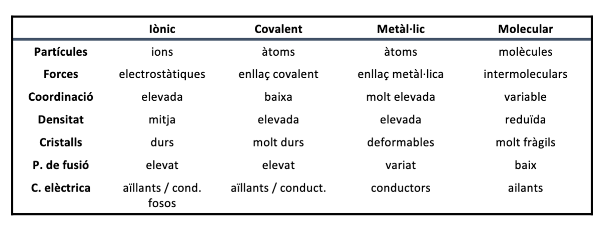
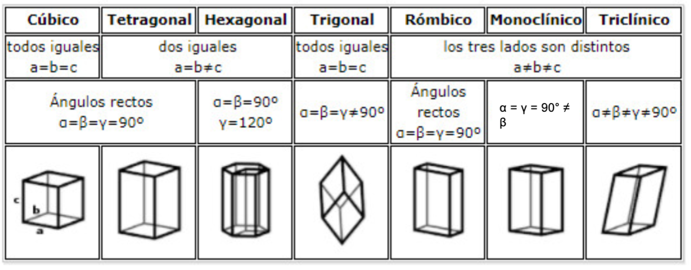

# Quimica

- [Quimica](#quimica)
  - [Principis Generals de la Quimica](#principis-generals-de-la-quimica)
    - [Transport aeri](#transport-aeri)
    - [La materia](#la-materia)
    - [Estats de la matéria](#estats-de-la-matéria)
    - [Disolucions](#disolucions)
    - [Gasos ideals](#gasos-ideals)
    - [Estructura atòmica](#estructura-atòmica)
    - [Propietats periodiques dels elements químics](#propietats-periodiques-dels-elements-químics)
    - [Enllaç químic](#enllaç-químic)
    - [Estructura molecular](#estructura-molecular)
    - [Propietats dels compostos químics](#propietats-dels-compostos-químics)
  - [Estat sòlid](#estat-sòlid)
    - [Nocions cristalografia](#nocions-cristalografia)
      - [Sistemes Cristalins](#sistemes-cristalins)

## Principis Generals de la Quimica

ciencia que estudia la matéria i les seves transformacions

### Transport aeri

- **Eficiencia**$\rarr$ reducció de pes$\rarr$disminució
- **Seguretat**$\rarr$ evitar fuites de combustible i falles en els motors
- **Comoditat**$\rarr$ insonorització, qualitat de l'aire, entreteniment...

### La materia

- **atom** part mínima d'un element química q presenta les mateixes propietats
  - Format per:
    - protons $\Rarr$ determina el nombre atòmic(Z)$\Rarr$ determina element$\Rarr$Determina les propieats fisico-quimiques
    - neutrons $\Rarr$ determina nombre de massa(A)$\Rarr$determina l'isotop
    - electrons $\Rarr$ determina la carrega(e)
  - Notació$\Rarr_Z^AX^{Z+e}$
  - Massa atòmica$\Rarr 1uma=\frac{1}{12}massa ^12C=\frac{1}{6,022·10^23}g$
- **element químic**$\Rarr$substància formada per un sol tipus d'atoms
- **compost**$\Rarr$ substància formada per més d'un tipus d'atoms
- **molecula**$\Rarr$ unitat mínima d'un compost que mante les propietats
- **substancia**$\Rarr$ és una forma de la matèria que té una composició definida i propietats particulars
- **mescla**$\Rarr$ és una combinació de dues o més substàncies en la que cada substància reté la seva identitat

### Estats de la matéria

- solid
  - Poca energia cinètica
  - Vibracions
  - Partícules empaquetades
  - Forces d’atracció grans
- liquid
  - Poc moviment
  - Llisquen entre elles
  - Moviments de torsió,
  - Vibració i estirament
- gas
  - Gran moviment
  - Energia cinètica molt gran
  - Moviments de translació
  - Xocs elàstics
  - No atraccions ni repulsions

### Disolucions

- percentatge en massa % $\% massa=\frac{g solut}{g dissolució}·100$
- percentatge en volum % vol$\%vol=\frac{mL solut}{mLdissolució}·100$
- percentatge en pes/volum$\%=\frac{g solut}{100 mL solució}$
- molaritat o concentració molar $M=\frac{mols solut}{L disolució}$
- molalitat o concentració molal $m=\frac{mols solut}{kg dissolvent}$
- fracció molar $X=\frac{mols solut}{mols solut+mol dissolvent}$
- grams per litre de dissolució $g/L=\frac{g solut}{L dissolució}$
- parts per milió $ppm=\frac{mg solut}{L dissolució}=\frac{mg substància}{kg total}=\frac{particules substancia}{10^6 particules totals}$

### Gasos ideals

**Llei dels gasos ideals** $PV=nRT\Rarr M=\frac{mR}{PVT}\Rarr \rho=\frac{MP}{RT}$

La teoria cinètica postula:

1. La distància que hi ha entre molècules d’un gas és molt més gran que la mida de la molècula (les molècules són com punts, tenen massa però no volum)
2. Les molècules del gas estan en continu moviment aleatori amb xocs perfectament elàstics entre molècules, no hi ha pèrdua d’energia en el conjunt
3. No hi ha forces d’atracció ni de repulsió entre les molècules del gas 4. L’energia cinètica promig de les molècules és proporcional a la temperatura

$u_{ms} = \sqrt{3RT / M }$

### Estructura atòmica

Nombres quantics

### Propietats periodiques dels elements químics

### Enllaç químic

### Estructura molecular

- Repulsion de pares de electrones de la capa de valéncia
- a partir de lewis
- Asumciones
  - enlaces mediante par de electrones
  - un enlace p

### Propietats dels compostos químics

## Estat sòlid

### Nocions cristalografia

- Amorfs: No tenen ordre a nivell microscopic
- Monocirstal·lí: una sola estructura en les tres direccións del espai
- Cristalls: Estructura de partícules que es repeteixen de manera ordenada en les tres direccions de l’espai.
- Policristalins diferents regions cristal·lines
- Semicristalins: alternar regions cristal·lines amb regions amorfes

#### Sistemes Cristalins

- Sistema de coordenades:
  - eixos x,y,z que coincideix en amb les arestes del prisma
  - Origenen un vèrtex(0,0,0)
- Geometria(sense tenir en compte els àtoms)
- dimensions definides per 6 paràmetres de xarxa:
  - Longitud de les tres arestes(a,b,c)
  - Angles interaxials:α(\< bc),b(\< ac)iγ(\< ab).

