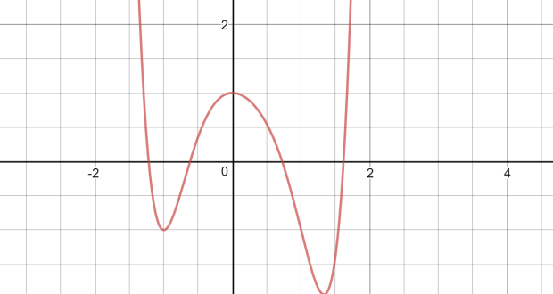
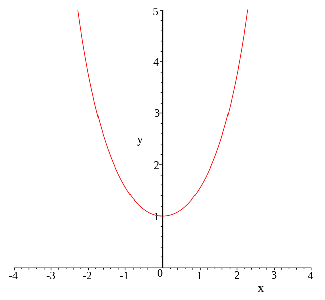
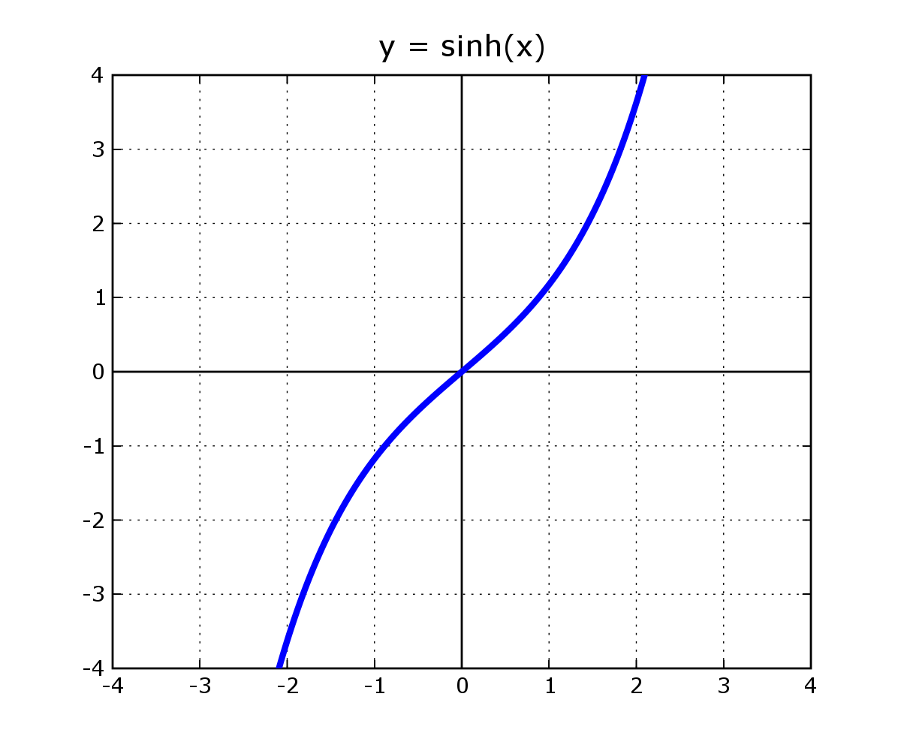
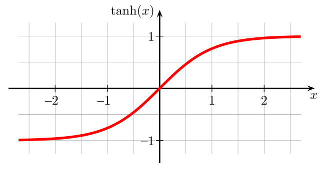

# Calculo

## Indice

- [Calculo](#calculo)
  - [Indice](#indice)
  - [Documentos](#documentos)
  - [T1 Funciones](#t1-funciones)
    - [Intro](#intro)
    - [Parametricación función](#parametricación-función)
      - [Dominio](#dominio)
      - [Imagen](#imagen)
      - [Funcions elementals](#funcions-elementals)
    - [Limites, continuidad i asímptotes](#limites-continuidad-i-asímptotes)
    - [Funciones cóniques](#funciones-cóniques)
  - [Derivadas](#derivadas)
    - [Condepto](#condepto)
    - [Regla cadena](#regla-cadena)
    - [Derivación logarítmica](#derivación-logarítmica)

## Documentos

- [Funciones Elementales](Documentos/CALC/Funcions_elementals.pdf)
- [Llista total excecicis](Documentos/CALC/Llista%20total%20exercicis.pdf)
- [T1 Equacions i grafiques](Documentos/CALC/T1_Equacions_i_grafiques-c.pdf)

## T1 Funciones

### Intro

- Funcion ($\R$ de variable $\R$): $f: A\subset\R \rightarrow \R$
  - objeto matemàtico q asigna a cada $A$ un **único** num $\in \R$
    - Ej: $f(x)=x^2$
  - Toda f permite una representación en el plano cómo curva

- Ergo:
  - $f(x)=x \Rightarrow$ <a name="#funció">funció</a>
  - $y=x^2 \Rarr$ curva en el plano de [f(x)](#función)
- Toda curva tiene una función asociada?
  - NO, pero se puede describir como un conjunto de estas

### Parametricación función

#### Dominio

- Conjuntos de valores para los cuales existe imagen $\exist f(x)$
- $Dom\ f=\{x\in \R; \exist f(x)\}$

#### Imagen

- $Im \ f=\{y\in\R;\ y=f(x),\ \forall x \in f(x)\}$

#### Funcions elementals

- **Lineal** $\Rarr f(x)=mx$
  - $m$: pendiente
  - $m=tan(\theta)$ siendo $\theta$ el angulo con eje-$x$
- **Afín** $\Rarr f(x)=mx+n$
  - $n$ ordenada de origen aka corte con y aka $f(0)$
- **Polinómica** $\Rarr f(x)=a_nx^n+a_{n-1}x^{n-1}+\dots+a_1x+a_0$
  - $a_i \in \R, \forall i$
- **Exponencial** $\Rarr f(x)=a^x$
  - $Dom\ f=(-\infty,\infty);Im\ f=(0\infty)$
  - $a>1$
    - $x>0 \Rarr a^x<1$
    - $x<0 \Rarr a^x>1$
  - $0<a<1$
    - $x>0 \Rarr a^x>1$
    - $x<0 \Rarr a^x<1$
  - $a^0=1$
  - $a^{x+y}=a^xa^y$
  - $a^{-y}=\frac{1}{a^{y}}$
  - $a^{xy}=(a^x)^y$
  - $a^{\log_ax}=x$
  - $a^x>0\forall x$
- **Logaritmica** $\Rarr f(x)=log_ax$
  - $a$: base
  - $Dom\ f=(0,+\infty); Img\ f= (-\infty,+\infty)$
  - $a>1$
    - $\log_ax<0$ si $0<x<1$
    - $\log_ax>0$ si $1<x$
  - $a<1$
    - $\log_ax<0$ si $x>1$
    - $\log_ax>0$ si $1<1$
  - $\log_a1=0$
  - $\log_auv=\log_au+\log_av$
  - $\log_a\frac{1}{v}=-\log_av$
  - $\log_au^v=v\log_au$
  - $\log_ax=\frac{\log_bx}{\log_ba}$
  - $\log_aa^x=x$
  - $\log_ax$ no $\exist$ si $x\leq0$
- **Valor absoluto** $\Rarr f(x)=|x|=\{x\ \forall\ x \geq0; -x\ \forall\ x \leq0\}$
  - $Dom\ f=\R; Img\ f= [ 0,+\infty)$
  - $|x|=|-x|$
  - $|x|=0\iff x=0$
  - $|x|=c\Rarr, c\geq0 x=\plusmn c$
  - $|x|=y\Rarr x=\plusmn y$
  - $|x|\leq c, c\geq 0 \iff -c\leq x\leq c$
  - $|x|\geq c, x\geq c o x\leq -c$
  - $|x+y|\leq|x|+|y|$
- **Trigonométricas**
  - Radianes
  - $\cos(x)=\frac{e^{jx}+e^{-jx}}{2}$
  - $\sin(x)=\frac{e^{jx}-e^{-jx}}{2j}$
  - $\tan(x)=\frac{\sin(x)}{\cos(x)}$
- **Hiperbólicas**
  - $\cosh(x)=\frac{e^x+e^{-x}}{2}$ 
  - $\sinh(x)=\frac{e^x-e^{-x}}{2}$ 
  - $\tanh(x)=\frac{\sin(x)}{\cosh(x)}=\frac{e^x-e^{-x}}{e^x+e^{-x}}$
  - $\cosh²x-\sinh²x=1$

### Limites, continuidad i asímptotes

[Power](Documentos/CALC/T1_Equacions_i_grafiques-c.pdf)

### Funciones cóniques

- Circunferencia
  - Lugar geometrico de los puntos del plano situados a distancia r de un un punto fijo (a,b)
  - $R\rarr$ radio
  - $O=(a,b)\rarr$ centro
  - $c={(x,y)\in \R²;d((x,y),(a,b))=R}$
  - $(x-a)²+(y-b)²=R²\Rarr x²+y²-2ax-2by+a+b-R²=0\Rarr x²+y²+Ax+By+C=0$
  - No todas las eq de la última forma definen una circunferencia
- Parabola
  - Lugar geometrico de los puntos del plano que eqidistan de un punto fijo llamado foco y una recta llamada directriz
  - Punto inferior se denomina vertize
  - Tiene un eje de simetria
  - $P:=\{(x,y)\in\R^2;d((x,y),F)=d((x,y),r)$
  - $y=ax^2\Rarr$Parabola vertical
    - vertice(0,0)
    - eje simm$\Rarr$ y
  - $y-y_0=a(x-x_0)^2$
    - Equación canconica parabola
    - eje sim $x=x_0$
    - vertice $(x_0,y_0)$
  - Equación general:
    - Desarrollando quadrados llegamos a
      - $y=ax^2+bx^2+c$
      - vertice en $x_0=\frac{-b}{2a}$
- Elipse
  - Lugar geometrico equidistante a dos puntos denominados focos
  - $E:=\{(x,y)\in \R^2;d((x,y),F)+d((x,y),F')=k$
  - $\frac{x^2}{a^2}+\frac{y^2}{b^2}=1$
  - 4 vertices
    - $(\plusmn a,0)$
    - $(0,\plusmn b)$
  - Centro $(x_0,y_0)$
  - $\frac{(x-x_0)^2}{a^2}+\frac{(y-y_0)^2}{b^2}=1$
- Hiperbola
  - Lugar geometrico de los puntos del plano tales que el valor absoluto de la diferencia de sus distancas a dos puntos fijos llamados focos es constante
  - $H:=\{(x,y)\in \R^2;|d((x,y),F)-d((x,y),F')|=k\}$
  - $|\frac{x^2}{a^2}-\frac{y^2}{b^2}|=k$
    - horizontal
    - vertice$\Rarr(\plusmn a,0)$
  - $|\frac{y^2}{b^2}-\frac{x^2}{a^2}|=k$
    - vertical
    - Vertcices$\Rarr (0,\plusmn b)$
  - Centro$\rarr(x_0,y_0)$
    - Horizontal
      - $\frac{(x-x_0)^2}{a^2}-\frac{(y-y_0)^2}{b^2}=1$
    - Vertcical
      - $\frac{(y-y_0)^2}{a^2}-\frac{(x-x_0)^2}{b^2}=1$
  - Equilateras
  - $y=\frac{k}{x}$

## Derivadas

### Condepto

### Regla cadena

### Derivación logarítmica

$h'=f^g(g'\ln f+g\frac{f'}{f})$

