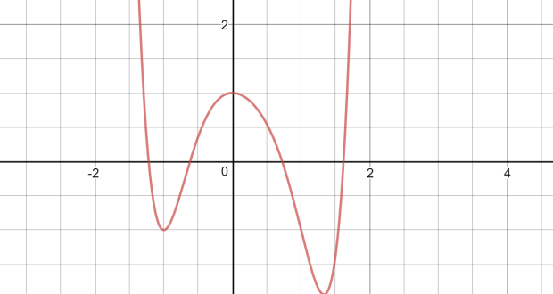

# Calculo

## T1 Funciones

### Intro

- Funcion ($\R$ de variable $\R$): $f: A\subset\R \rightarrow \R$
  - objeto matemàtico q asigna a cada $A$ un **único** num $\in \R$
    - Ej: $f(x)=x^2$
  - Toda f permite una representación en el plano cómo curva
    
  - Ergo:
    - $f(x)=x \Rightarrow$ funció
    - $y=x^2 \Rarr$ curva en el plano de 
  - Toda curva tiene una función asociada?
    - NO, pero se puede describir como un conjunto de estas

### Parametricación función

#### Dominio

- Conjuntos de valores para los cuales existe imagen $\exist f(x)$
- $Dom\ f=\{x\in \R; \exist f(x)\}$

#### Imagen

- $Im \ f=\{y\in\R;\ y=f(x),\ \forall x \in f(x)\}$

#### Funcions **elementals**

- **Lineal** $\Rarr f(x)=mx$
  - $m$: pendiente
  - $m=tan(\theta)$ siendo $\theta$ el angulo con eje-$x$
- **Afín** $\Rarr f(x)=mx+n$
  - $n$ ordenada de origen aka corte con y aka $f(0)$
- **Polinómica** $\Rarr f(x)=a_nx^n+a_{n-1}x^{n-1}+\dots+a_1x+a_0$
  - $a_i \in \R, \forall i$
- **Exponencial** $\Rarr f(x)=a^x$
  - $Dom\ f=(-\infty,\infty);Im\ f=(0\infty)$ <!-- TODO: preguntar caso $a<0$ -->
  - $a>1$
    - $x>0 \Rarr a^x<1$
    - $x<0 \Rarr a^x>1$
  - $0<a<1$
    - $x>0 \Rarr a^x>1$
    - $x<0 \Rarr a^x<1$
  - $a^0=1$
  - $a^{x+y}=a^xa^y$
  - $a^{-y}=\frac{1}{a^{y}}$
  - $a^{xy}=(a^x)^y$
  - $a^{\log_ax}=x$
- **Logaritmica** $\Rarr f(x)=log_ax$
  - $a$: base
<!--TODO: completar apuntes log-->
  
- **Valor absolur** $\Rarr f(x)=|x|=\{x \forall x >=0; -x\forall <=0}$