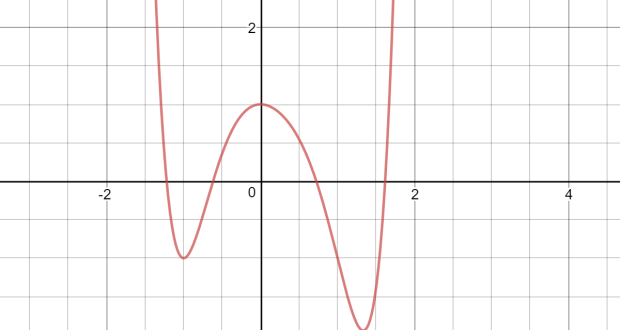

#  Calculo
  
  
##  Indice
  
  
- [Calculo](#calculo )
  - [Indice](#indice )
  - [Documentos](#documentos )
  - [T1 Funciones](#t1-funciones )
    - [Intro](#intro )
    - [Parametricación función](#parametricación-función )
      - [Dominio](#dominio )
      - [Imagen](#imagen )
      - [Funcions elementals](#funcions-elementals )
  
##  Documentos
  
  
- [Funciones Elementales](Documentos/CALC/Funcions_elementals.pdf )
- [Llista total excecicis](Documentos/CALC/Llista%20total%20exercicis.pdf )
- [T1 Equacions i grafiques](Documentos/CALC/T1_Equacions_i_grafiques-c.pdf )
  
##  T1 Funciones
  
  
###  Intro
  
  
- Funcion ( de variable ): 
  - objeto matemàtico q asigna a cada  un **único** num 
    - Ej: 
  - Toda f permite una representación en el plano cómo curva
  

  
  - Ergo:
    -  <a name="#funció">funció</a>
    -  curva en el plano de [f(x)](#función )
  - Toda curva tiene una función asociada?
    - NO, pero se puede describir como un conjunto de estas
  
###  Parametricación función
  
  
####  Dominio
  
  
- Conjuntos de valores para los cuales existe imagen 
- 
  
####  Imagen
  
  
- 
  
####  Funcions elementals
  
  
- **Lineal** 
  - : pendiente
  -  siendo  el angulo con eje-
- **Afín** 
  -  ordenada de origen aka corte con y aka 
- **Polinómica** 
  - 
- **Exponencial** 
  -  
  - 
    - 
    - 
  - 
    - 
    - 
  - 
  - 
  - 
  - 
  - 
  - 
- **Logaritmica** 
  - : base
  - 
  - 
    -  si 
    -  si 
  - 
    -  si 
    -  si 
  - 
  - 
  - 
  - 
  - 
  - 
  -  no  si 
  
- **Valor absoluto** 
  - 
  - 
  - 
  - 
  - 
  - 
  - 
  - 
- **Trigonométricas**
  - Radianes
  